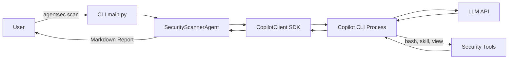
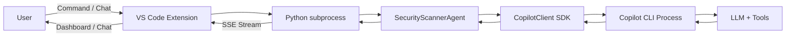
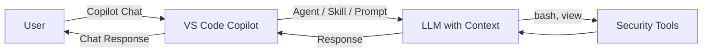
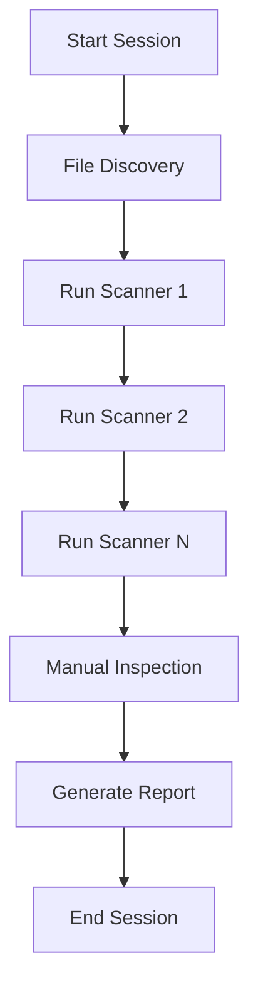
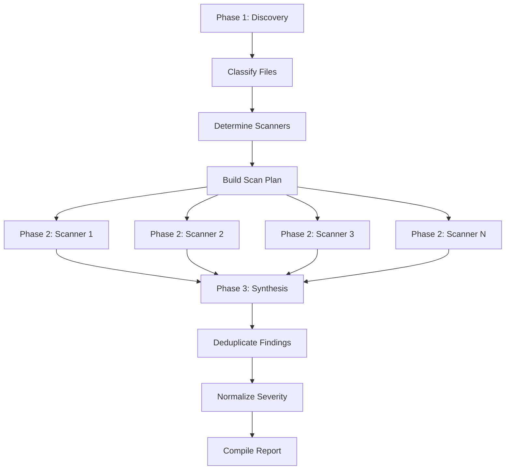

# Architecture Overview
{: .no_toc }

Technical deep-dive into how Sec-Check is built, for contributors and advanced users.
{: .fs-6 .fw-300 }

<details open markdown="block">
  <summary>Table of contents</summary>
  {: .text-delta }
- TOC
{:toc}
</details>

---

## Monorepo Structure

Sec-Check is organized as a monorepo with three independent packages:

```
sec-check/
├── core/                  # Shared agent library (Python)
│   └── agentsec/
│       ├── agent.py              # SecurityScannerAgent class
│       ├── config.py             # AgentSecConfig — YAML + CLI config
│       ├── orchestrator.py       # ParallelScanOrchestrator
│       ├── progress.py           # ProgressTracker (contextvars)
│       ├── session_runner.py     # Shared session-wait logic
│       ├── session_logger.py     # Per-session file logging
│       ├── skill_discovery.py    # SCANNER_REGISTRY, classify_files()
│       ├── tool_health.py        # Stuck detection, error patterns
│       └── skills.py             # Legacy @tool functions
│
├── cli/                   # Command-line interface (Python)
│   └── agentsec_cli/
│       └── main.py               # argparse CLI entry point
│
├── vscode-extension/      # VS Code extension (TypeScript)
│   ├── src/                      # Extension source code
│   ├── media/                    # Icons and assets
│   └── package.json              # Extension manifest
│
└── .github/               # Copilot Toolkit
    ├── agents/                   # Custom agent definitions
    ├── skills/                   # Security scanner skills
    ├── prompts/                  # Custom prompt commands
    └── .context/                 # Attack patterns reference
```

---

## Communication Flow

### CLI Path



### VS Code Extension Path



### Copilot Toolkit Path



---

## Scanning Workflow

### Sequential Mode

A single LLM session performs all scanning steps:



### Parallel Mode (3-Phase)



**Key design decisions:**
- Each scanner runs in its own Copilot SDK session (process isolation)
- `asyncio.gather` with a semaphore controls concurrency
- Failures in one scanner don't affect others
- The synthesis phase merges and deduplicates results

---

## Core Components

### SecurityScannerAgent

The main agent class that manages the scan lifecycle:

- **Session Management** — creates, monitors, and cleans up Copilot SDK sessions
- **Stall Detection** — monitors tool activity via SDK events; nudges after 120s of inactivity
- **Timeout Handling** — configurable safety ceiling with partial result extraction
- **Error Recovery** — transient error retry with exponential backoff

### AgentSecConfig

Configuration dataclass that merges settings from multiple sources:

```
CLI flags  →  YAML file  →  Built-in defaults
(highest)                    (lowest priority)
```

Each setting tracks its **provenance** (where the value came from) for debugging.

### ParallelScanOrchestrator

Manages the 3-phase parallel scanning workflow:

1. Uses `skill_discovery.py` to classify files and select scanners
2. Creates one sub-agent session per scanner with scanner-specific prompts
3. Feeds all results into a synthesis session for report compilation

### ProgressTracker

Uses Python `contextvars.ContextVar` to provide thread-safe progress updates:

- File discovery count
- Per-file scan progress
- Issues found per file
- Overall completion percentage

### ToolHealth Monitor

Tracks tool invocation patterns to detect issues:

- Stuck tools (long-running without output)
- Error pattern recognition
- Health scoring for scanner reliability

---

## Technology Stack

| Component | Technology |
|:----------|:-----------|
| Agent runtime | Python 3.12, asyncio |
| LLM integration | GitHub Copilot SDK (`github-copilot-sdk`) |
| CLI framework | argparse |
| Configuration | YAML (PyYAML), dataclasses |
| VS Code extension | TypeScript, VS Code API, esbuild |
| Documentation site | Jekyll, just-the-docs theme, GitHub Pages |
| CI/CD | GitHub Actions |

---

## Key Design Principles

1. **Tool-agnostic scanning** — The agent uses Copilot CLI built-in tools (`bash`, `skill`, `view`) to invoke any scanner. New scanners can be added as Copilot skills without changing agent code.

2. **Graceful degradation** — Missing tools are detected at runtime and skipped. The agent always produces a report with whatever tools are available.

3. **Safety by default** — The system message includes comprehensive guardrails against executing scanned code, prompt injection from analyzed code, and dangerous commands.

4. **Configurable everything** — System message, prompt, model, timeout, concurrency — all customizable via YAML, CLI flags, or VS Code settings.

5. **Isolation in parallel mode** — Each scanner sub-agent runs in its own SDK session. A crash or timeout in one scanner doesn't affect others.
