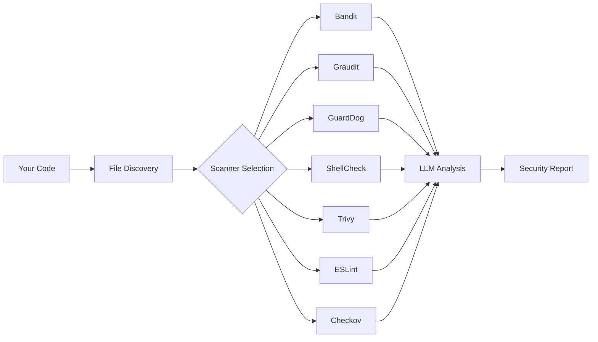

# Sec-Check
{: .fs-9 }

Scan untrusted code for red flags before you run it — exfiltration, reverse shells, backdoors, and supply-chain traps.
{: .fs-6 .fw-300 }

[Get Started in 5 Minutes](#quick-start){: .btn .btn-primary .fs-5 .mb-4 .mb-md-0 .mr-2 }
[View on GitHub](https://github.com/alxayo/sec-check){: .btn .fs-5 .mb-4 .mb-md-0 }

---

## What is Sec-Check?

Sec-Check is an **AI-powered security scanning toolkit** that orchestrates multiple industry-standard security tools and combines them with LLM-based semantic code review. It is available in three forms:

| Component | Description |
|:----------|:------------|
| **VS Code Copilot Toolkit** | Custom agent, skills, and prompts that run inside GitHub Copilot Chat |
| **CLI Tool (AgentSec)** | Standalone command-line scanner built with the GitHub Copilot SDK |
| **VS Code Extension** | Native extension with dashboard, tree views, and chat participant |

### What It Detects

- 🔓 **Credential theft & data exfiltration** — API keys, tokens, DNS/HTTP exfil
- 🐚 **Reverse shells & backdoors** — netcat, bash redirects, named pipes
- 🧬 **Obfuscated payloads** — base64, hex, eval/exec chains
- 📦 **Supply chain attacks** — typosquatting, malicious packages, dependency confusion
- 💣 **System destruction** — rm -rf, disk wiping, ransomware patterns
- 🔄 **Persistence mechanisms** — cron jobs, registry keys, startup items
- 💉 **Injection vulnerabilities** — SQL injection, XSS, command injection, Log4Shell

{: .warning }
> Sec-Check catches common red flags, not sophisticated zero-day attacks. Always combine with manual review and sandboxing for high-risk code.

---

## Quick Start
{: #quick-start }

Get scanning in under 5 minutes. Pick the option that matches your workflow:

### Option A: VS Code Copilot Toolkit (Recommended)
{: .text-green-200 }

No installation needed — works directly in GitHub Copilot Chat.

**Prerequisites:** VS Code with [GitHub Copilot](https://marketplace.visualstudio.com/items?itemName=GitHub.copilot) extension installed.

**1. Clone the repo** to get the skills and prompts:
```bash
git clone https://github.com/alxayo/sec-check.git
cd sec-check
```

**2. Open the folder in VS Code:**
```bash
code .
```

**3. Run a scan** — open Copilot Chat and type:
```
/sechek.security-scan
```

That's it! Copilot will analyze your workspace using all available security tools and generate a detailed report.

{: .tip }
> For faster targeted scans, try `/sechek.security-scan-quick` or language-specific prompts like `/sechek.security-scan-python`.

---

### Option B: Standalone CLI Tool

**Prerequisites:** Python 3.11+ and [GitHub Copilot CLI](https://docs.github.com/en/copilot/using-github-copilot/using-github-copilot-in-the-command-line) installed and authenticated.

**1. Install:**
```bash
pip install agentsec-cli
```

Or install from source:
```bash
git clone https://github.com/alxayo/sec-check.git
cd sec-check
pip install -e ./core
pip install -e ./cli
```

**2. Authenticate Copilot CLI** (one-time):
```bash
copilot auth login
```

**3. Scan a folder:**
```bash
agentsec scan ./my-project
```

**4. View the report** — AgentSec generates a Markdown security report with severity levels, code snippets, and remediation advice.

{: .tip }
> Add `--parallel` for faster scans using concurrent sub-agents: `agentsec scan ./my-project --parallel`

---

### Option C: VS Code Extension

**1. Install** from the VS Code Marketplace (or build from source):

```bash
cd vscode-extension
npm install && npm run build
npx vsce package
# Install the generated .vsix file in VS Code
```

**2. Scan** — open the Command Palette (`Ctrl+Shift+P`) and run:

```
AgentSec: Scan Workspace for Security Issues
```

Or use the chat participant:

```
@agentsec /scan
```

---

## How It Works



1. **File Discovery** — Scans the target directory to find all source files
2. **Scanner Selection** — Determines which security tools are relevant based on file types
3. **Parallel Scanning** — Runs applicable scanners concurrently (in parallel mode)
4. **LLM Analysis** — Uses AI to perform semantic code review for patterns scanners miss
5. **Report Generation** — Compiles all findings into a prioritized Markdown report

---

## Next Steps

| What you want to do | Where to go |
|:---------------------|:------------|
| Detailed install instructions | [Installation Guide]() |
| Learn the CLI tool | [CLI User Guide]() |
| Use VS Code Copilot skills | [Copilot Toolkit Guide]() |
| Use the VS Code extension | [Extension Guide]() |
| Configure scanning behavior | [Configuration Reference]() |
| See all available scanners | [Scanners Reference]() |
| Understand the architecture | [Architecture Overview]() |
| Fix common issues | [Troubleshooting]() |
